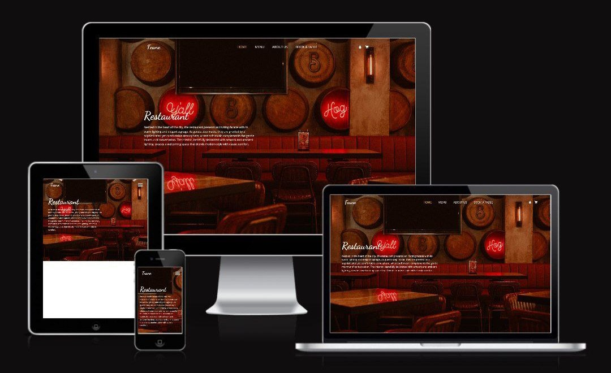
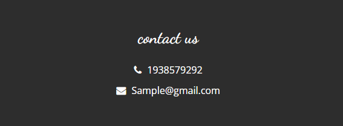
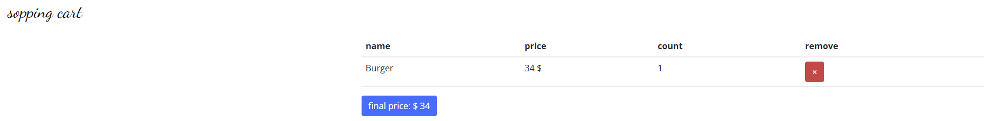
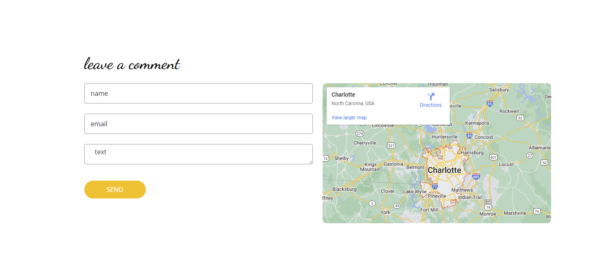
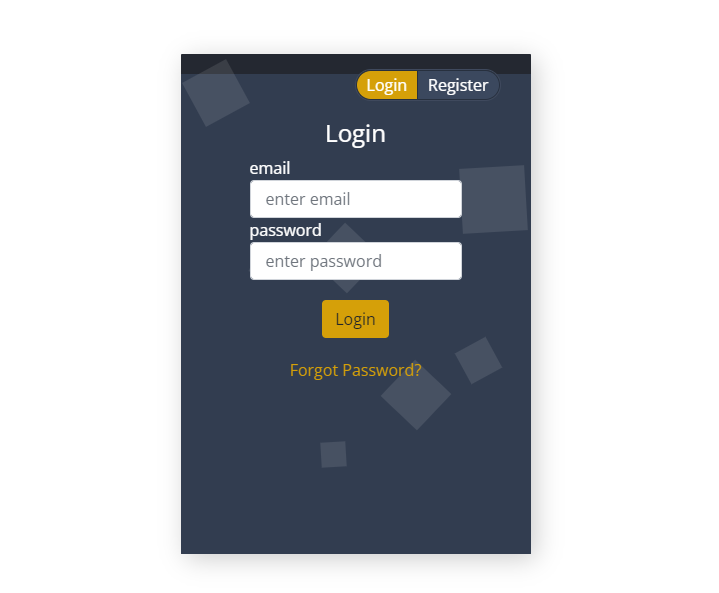
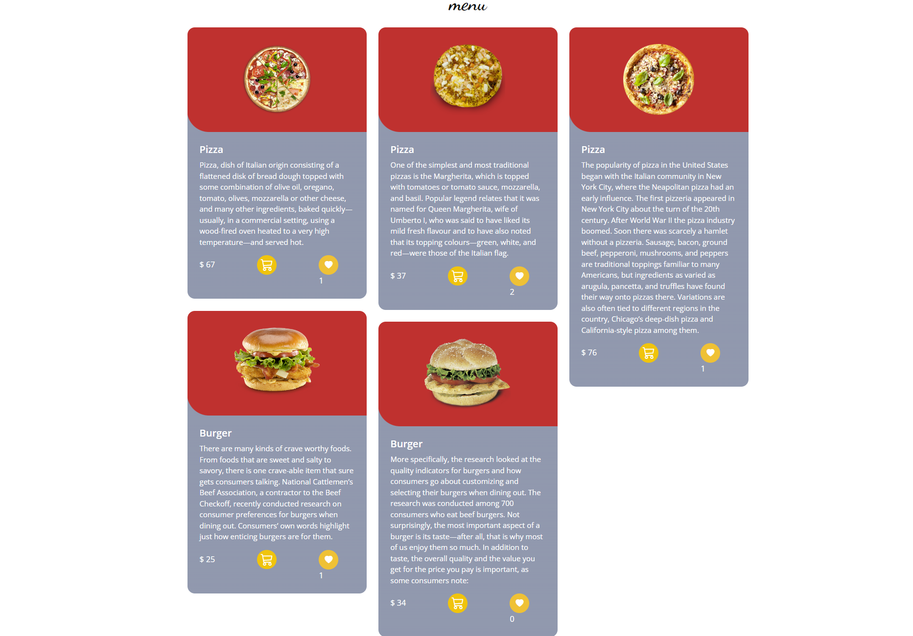
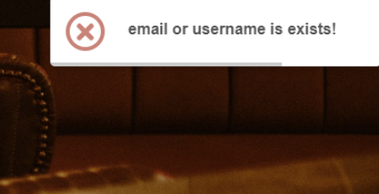
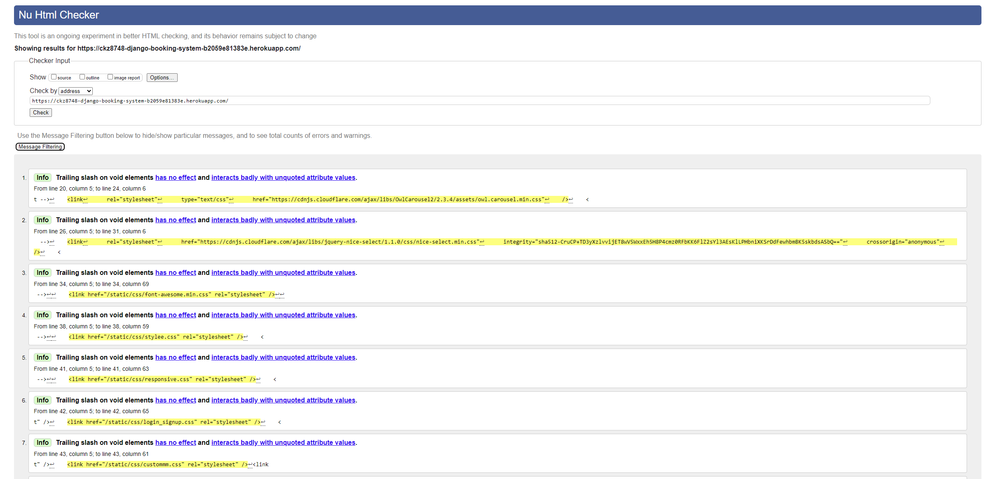
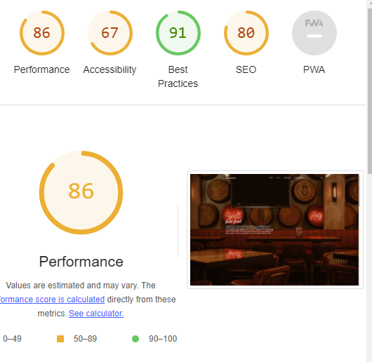

# Restaurant Booking System

Welcome to the Restaurant Booking System, a user-friendly platform that allows you to effortlessly reserve and purchase food online. Whether you're planning a casual meal or a special occasion, our website provides a seamless experience for booking tables at your convenience.

The site is fully responsive and was built using the Django framework in Python.

The live site has been deployed [here](https://ckz8748-django-booking-system-b2059e81383e.herokuapp.com/).

## Table of Contents

- [Live Site](https://ckz8748-django-booking-system-b2059e81383e.herokuapp.com/)
- [Overview](#overview)
- [Key Features](#key-features)
- [User Stories](#user-stories)
- [Features](#features)
- [Design](#design)
- [About Us](#about-us)
- [Forms](#forms)
- [Custom 404 Error](#custom-404-error)
- [Custom Models](#custom-models)
- [Other Features](#other-features)
- [Deployment](#deployment)
- [Testing](#testing)
- [Screenshots](#screenshots)
- [Contributing](#contributing)
- [License](#license)

## Overview

Our restaurant booking site is built on the Django framework using Python, ensuring a robust and secure foundation. The site boasts a fully responsive design, making it accessible on various devices, and offers a user-friendly interface for a smooth experience.

## Key Features

- **Table Reservation**: Easily book tables for any date and time that suits your schedule.
- **Online Food Purchase**: Browse the menu and order your favorite dishes online.
- **Responsive Design**: Access the site seamlessly on desktops, tablets, and mobile devices.
- **User-Friendly Interface**: Intuitive design for a hassle-free booking and ordering process.

## User Stories

- As a **customer**, I want to easily browse the available tables and select the one that fits my preferences.
- As a **user**, I want the ability to create an account and log in to manage my reservations and orders.
- As a **food enthusiast**, I want to view the menu with detailed descriptions and images.
- As a **busy professional**, I want a quick and efficient checkout process for online food purchases.
- As a **restaurant manager**, I want to manage table availability, view reservations, and update the menu.
- As a **mobile user**, I want the site to be responsive, allowing me to make reservations or orders on the go.

## Features

### User Authentication and Account Management

- Registration, login, and password reset functionalities.
- User-friendly forms for signup, login, password reset, and reservation.

### Shopping Cart

- Add foods to the shopping cart.
- Manage the shopping cart by updating quantities and removing items.
- Checkout and place orders with order history tracking for users.

### Admin Dashboard

- Admin dashboard for managing food, reservations, and users.
- Admin approval required for food items before they appear on the main page.

### User Comments

- Users can leave comments on food items.
- Admin can review and approve comments before displaying them on the main page.

### Custom Models

- Users can create and manage their reservations, adding, removing, or editing their reservations.
- Users can leave comments and like food items on the menu.
- Users can track the status of their orders and reservations.

### Other Features

- Social media marketing through platforms like Facebook and Instagram.
- Influencer collaborations and partnerships for brand visibility and sales.
- SEO techniques for improved organic visibility.

### Deployment

- Deployed using GitPod and Heroku.
- Utilized a Procfile and Gunicorn for running code on Heroku.

### Testing

- Comprehensive testing using the Django test framework.
- Users must log in first to access all features of the site.

## Design

The Restaurant Booking System follows a clean and intuitive design:

- **Color Scheme**: Utilizes a modern and inviting color palette to enhance the visual appeal.
- **Typography**: Employs easy-to-read fonts for a comfortable browsing experience.
- **Responsive Layout**: Adapts seamlessly to different screen sizes, ensuring accessibility across devices.
- **Intuitive Navigation**: Provides clear and logical navigation paths for a user-friendly experience.

## About Us

At Restaurant Booking System, we are passionate about delivering a delightful dining experience. Our team is dedicated to providing you with a seamless and user-friendly platform to make your table reservations and online food purchases hassle-free. We believe in the joy of sharing delicious meals and creating memorable moments. Thank you for choosing us for your dining needs.

## Forms

Users can leave comments, sign up, log in, reset passwords, and make reservations with forms. They can also access their reservation information in the shopping cart or panel.

## Custom 404 Error

A custom 404 error page is implemented to provide a user-friendly experience when a page is not found.

## Custom Models

1. Users can create and manage their reservations, adding, removing, or editing their reservations.
2. Users can leave comments and like food items on the menu.
3. Users can track the status of their orders and reservations.

## Other Features

- Social media marketing through platforms like Facebook and Instagram to reach and engage with the target audience.
- Influencer collaborations and partnerships to increase brand visibility and generate sales.
- The HTML templates include descriptive meta tags that enhance search engine visibility and provide meaningful information about the website's pages.
- Search engine optimization (SEO) techniques to improve organic visibility and attract potential customers.

## Deployment

I deployed this website using GitPod, Heroku, and following the below steps:

1. Log in to GitHub.
2. Log in to Heroku.
3. Use GitPod to deploy and commit changes to GitHub.
4. Add Procfile and Gunicorn for running code on Heroku.

## Contact Us

For any inquiries or assistance, please feel free to contact us at [info@restaurantbookingsystem.com](mailto:info@restaurantbookingsystem.com).

## Screenshots

**Basket Page**: Users can view and manage the items in their shopping cart.This page displays the items in the user's shopping cart. Users can view the selected items and manage their quantities before proceeding to checkout. It provides a convenient overview of the chosen items for the user.

![About]
**About Us Page**: Learn more about our team and our commitment to delivering a delightful dining experience.This section provides users with information about the team behind the Restaurant Booking System. It offers insights into the company's values, mission, and dedication to delivering a delightful dining experience.

**Comments Section**: Users can leave comments on food items. This section showcases user-generated content and allows for interaction. Admins have the capability to review and approve comments before they are displayed on the main page, ensuring content quality.

**Food Menu Page**: This is the main menu page where users can explore a comprehensive list of dishes. Each item typically includes rich descriptions and images to enhance the user's understanding of the available options.

**Header Section**: The header is a crucial part of the website's layout, providing clear and intuitive navigation. It typically includes the restaurant's logo, navigation links, and may also include a search bar or other relevant elements.

**Login Page**: Users can access their accounts securely by logging in. This page is essential for user authentication, allowing registered users to manage their reservations, orders, and preferences.

**Menu Page**: Similar to the Fooder page, this is another view of the menu. It may present different sections or categories of dishes, making it easy for users to explore and find their desired items.

**Notification Section**: This section provides users with updates and notifications related to their orders. It enhances user communication and keeps them informed about the status of their reservations or food orders.

## Testing

All parts of views and forms were tested using the inner framework of Django test. Users must log in first to use all features of the site.

### HTML

- HTML validation was carried out using the [Nu HTML Checker tool](https://validator.w3.org/) by W3C.
- Links are provided where the page could be tested using the URL.

#

- #### Home Page Validation

  - [Link](https://validator.w3.org/nu/?doc=https%3A%2F%2Fyour-restaurant-booking-site.com%2F)

  

...

### Lighthouse

- Lighthouse, using Chrome Dev Tools, was used to ensure best practices were followed on the site.

  

## Contributing

We welcome contributions from the community! If you find ways to improve the website or have suggestions for enhancements, please feel free to open an issue or create a pull request. Your input is valuable to the continued development and improvement of the Restaurant Booking System.

## License

This project is licensed under the [MIT License](LICENSE).

Thank you for choosing the Restaurant Booking System! We hope you enjoy your dining experience with us.

